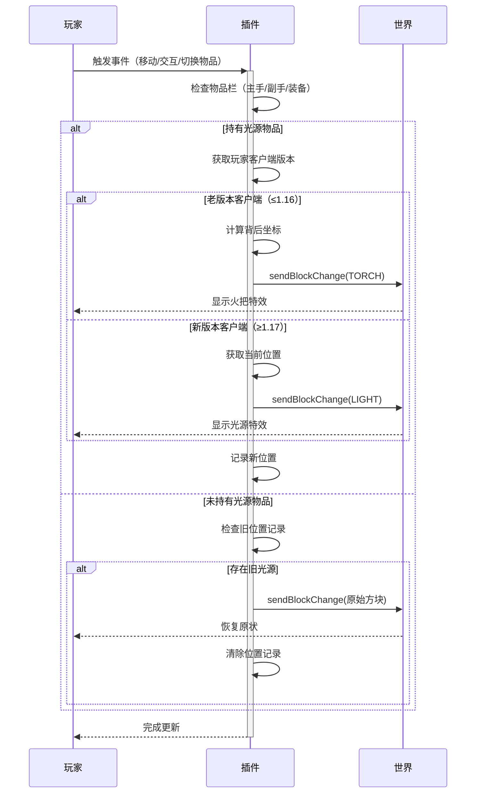

# mobilelight
一个安装在服务上的移动光源 ( 给不会装模组和材质的玩家和基岩版玩家的方便 ) 
 
如果服务器是高版本并且安装了都多版本插件，会给低版本使用兼容模式，基岩版可以正常使用
 
这是我这辈子做过最麻烦的插件
# 移动光源插件逻辑流程

```mermaid
sequenceDiagram
    participant 玩家 as 玩家
    participant 插件 as 插件
    participant 世界 as 世界
    
    玩家->>+插件: 触发事件（移动/交互/切换物品）
    插件->>插件: 检查物品栏（主手/副手/装备）
    
    alt 持有光源物品
        插件->>插件: 获取玩家客户端版本
        alt 老版本客户端（≤1.16）
            插件->>插件: 计算背后坐标
            插件->>世界: sendBlockChange(TORCH)
            世界-->>玩家: 显示火把特效
        else 新版本客户端（≥1.17）
            插件->>插件: 获取当前位置
            插件->>世界: sendBlockChange(LIGHT)
            世界-->>玩家: 显示光源特效
        end
        插件->>插件: 记录新位置
    else 未持有光源物品
        插件->>插件: 检查旧位置记录
        alt 存在旧光源
            插件->>世界: sendBlockChange(原始方块)
            世界-->>玩家: 恢复原状
            插件->>插件: 清除位置记录
        end
    end
    
    插件-->>-玩家: 完成更新
```

